Fourth-year CSE student, specialising in AI/ML.

I'm drawn to the problems that start out as edge cases and quietly turn into the
whole problem. A lot of my time goes into rethinking the flow a user actually
takes through a product rather than the one we assumed they'd take, and into
writing code that stays reasonable as it grows.

---

### Currently building

**[shopxy](https://github.com/TrendySloth1001/shopxy)** — a commerce and invoicing
platform built as three surfaces over one backend:

- a **merchant** app for inventory, invoices, parties and vendors
- a **customer** companion app showing invitations and per-shop invoice ledgers
- a shared **Express + Prisma + Postgres** backend, with the same JWT shape across
  both apps so one account works in either

Both clients are Flutter, with web and desktop builds alongside mobile. The stack
runs on Docker Compose — Postgres, Redis and MinIO — and the interesting parts have
been the account-linking model between merchants and customers, POS payment flows,
and keeping the accounting side auditable.

---

### Technologies

**Languages and frameworks**

<table>
<tr>
<td align="center" width="95"> TypeScript</td>
<td align="center" width="95"> Dart</td>
<td align="center" width="95"> Flutter</td>
<td align="center" width="95"> React</td>
<td align="center" width="95"> Node.js</td>
<td align="center" width="95">
<picture><source media="(prefers-color-scheme: dark)" srcset="https://cdn.simpleicons.org/express/FFFFFF" /></picture>
 Express</td>
<td align="center" width="95"> Python</td>
</tr>
</table>

**Data and queues**

<table>
<tr>
<td align="center" width="95"> PostgreSQL</td>
<td align="center" width="95">
<picture><source media="(prefers-color-scheme: dark)" srcset="https://cdn.simpleicons.org/prisma/A9B4C4" /></picture>
 Prisma</td>
<td align="center" width="95"> Redis</td>
<td align="center" width="95"> BullMQ</td>
<td align="center" width="95"> MinIO</td>
</tr>
</table>

**Infrastructure and hosting**

<table>
<tr>
<td align="center" width="95"> Docker</td>
<td align="center" width="95"> Nginx</td>
<td align="center" width="95"> Coolify</td>
<td align="center" width="95"> Cloudflare</td>
<td align="center" width="95"> SSH</td>
<td align="center" width="95"> Linux</td>
<td align="center" width="95"> Git</td>
</tr>
</table>

Deploys go out through Coolify, with Cloudflare Tunnels and plain SSH doing the reaching-in. BullMQ and SSH have no official brand mark, so they borrow the Redis and shell icons above.
